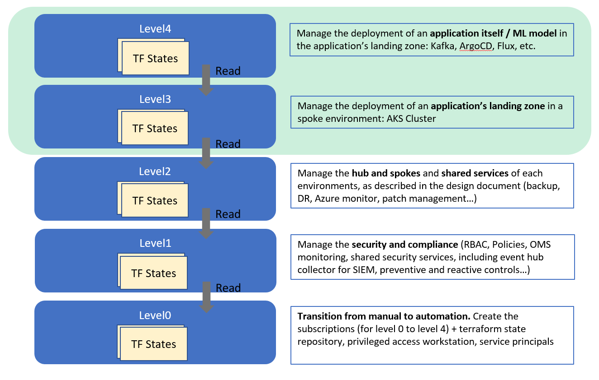
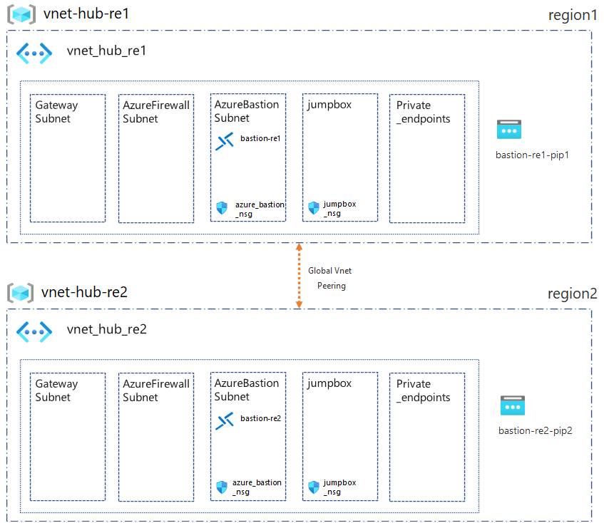
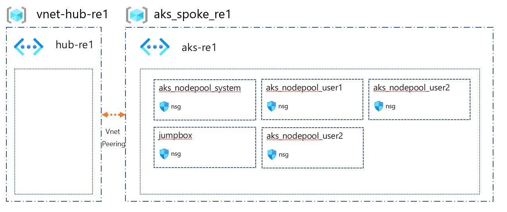

# CAF landing zones for Terraform - AKS landing zone examples

AKS landing zones are designed to fit into an enterprise-scale environment, in this guide, you will find the steps to bootstrap an environment to deploy the AKS landing zones.

## AKS landing zones examples

The CAF landing zone for AKS provides you with the following examples:

## Cloud Adoption Framework layered approach

AKS landing zone operates at **level 3** (light green area), so before you are able to deploy them you will need to deploy the prerequisites enterprise landing zones.



For a review of the hierarchy approach of Cloud Adoption Framework for Azure landing zones on Terraform, you can refer to [the following documentation](https://github.com/Azure/caf-terraform-landingzones/blob/master/documentation/code_architecture/hierarchy.md).

### Core AKS landing zone (level 3)

| AKS landing zone example                                                                                              | Description                                                |
|---------------------------------------------------------------------------------------------------|------------------------------------------------------------|
| [101-single-cluster](./aks/101-single-cluster)| Provision single AKS cluster within open virtual network |
| [102-multi-nodepools](./aks/102-multi-nodepools)| Provision single AKS cluster with multiple node pool within separate subnet (1 open virtual network). |
| [103-multi-clusters](./aks/103-multi-clusters)| Provision multiple AKS clusters in separate regions, using availability zones.                     |
| [104-private-cluster](./aks/104-private-cluster)| Provision private AKS clusters within private virtual network with Hub & Spoke UDR to Azure Firewall |
| [401-blue-green-nodepool](./aks/401-blue-green-nodepool)| Provision single AKS cluster and perform blue green nodepool upgrade with zero downtime |

### AKS Application landing zone  (level 4)

Deploys Applications Landing zone on top of an AKS Landing zone
| Application Landing Zone Example                                                                                              | Description                                                |
|---------------------------------------------------------------------------------------------------|------------------------------------------------------------|
| [Flux](./examples/applications/flux)| Provision Flux helm charts on AKS LZ |
| [ArgoCD](./examples/applications/argocd)| Provision ArgoCD helm charts on AKS LZ |
| [Kafka](./examples/applications/kafa)| Provision Kafka helm charts on AKS LZ |

## Setting up your test environment

With the following steps, you can deploy a simplified enterprise framework that setups the minimal foundations for enterprise (showing as levels 0-2 in the above picture)

Once those steps are completed, you will be able to run the AKS landing zones:

### Authenticate to your development environment

We assume that at this step, you have cloned the AKS landing zones repository (this repo) on your machine and have opened it into Visual Studio Code development environment.

Once into the development environment, please use the following steps:

```bash
# Login the Azure subscription
rover login -t [TENANT_ID/TENANT_NAME] -s [SUBSCRIPTION_GUID]
# Environment is needed to be defined, otherwise the below LZs will land into sandpit which someone else is working on
export environment=[YOUR_ENVIRONMENT]
export random_length=5
git clone --branch 2010.0.2 https://github.com/Azure/caf-terraform-landingzones.git /tf/caf/public

```

### Apply foundations (level 0 and 1)

```bash
# This is a specifically tailored version of the launchpad for this example and does not typically show all the launchpad features. Here it deploy the launchpad to store the tfstates, deploy log analytics, etc.
rover -lz /tf/caf/public/landingzones/caf_launchpad \
  -launchpad \
  -var-folder /tf/caf/examples/1-dependencies/launchpad/150 \
  -level level0 \
  -env ${environment} \
  -var random_length=${random_length} \
  -a [plan|apply|destroy]

# Level1
## To deploy AKS some dependencies, some accounting, security and governance services are required.
rover -lz /tf/caf/public/landingzones/caf_foundations \
  -level level1 \
  -env ${environment} \
  -a [plan|apply|destroy]

# Deploy shared_services typically monitoring, site recovery services, azure image gallery. In this example we dont deploy anything but it will expose the Terraform state to level 3 landing zones, so is required.
rover -lz /tf/caf/public/landingzones/caf_shared_services/ \
  -tfstate caf_shared_services.tfstate \
  -parallelism 30 \
  -level level2 \
  -env ${environment} \
  -a [plan|apply]
```

### Apply level 2 - network hub

The networking hub is part of the core enterprise landing zone services, you can deploy it with the following command:

```bash
rover -lz /tf/caf/public/landingzones/caf_networking/ \
  -tfstate networking_hub.tfstate \
  -var-folder /tf/caf/public/landingzones/caf_networking/scenario/101-multi-region-hub \
  -env ${environment} \
  -level level2 \
  -a [plan|apply]
```

This deployment adds the following components:


### Apply level 3 - network spoke

```bash
# Deploy networking spoke for AKS
rover -lz /tf/caf/public/landingzones/caf_networking/ \
  -tfstate networking_spoke_aks.tfstate \
  -var-folder /tf/caf/examples/1-dependencies/networking/spoke_aks/single_region \
  -env ${environment} \
  -level level3 \
  -a [plan|apply|destroy]

```

This deployment adds the following components:


Once the previous steps have been completed, the deployment of the lightweight enterprise scaffold to execute the AKS example landingzones is ready and you can step to one of the examples.
