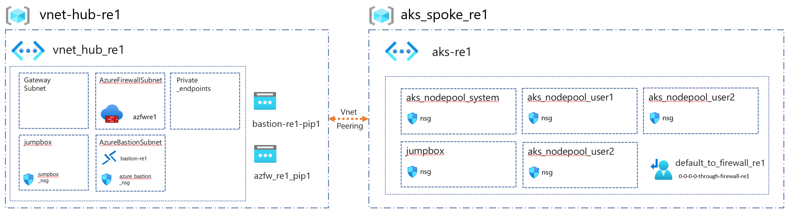

# CAF landing zones for Terraform - AKS private cluster example

Deploys an AKS private cluster in a hub & spoke topology with user defined routes redirection via Azure Firewall for egress traffic.

AKS landing zone operates at **level 3**.

For a review of the hierarchy approach of Cloud Adoption Framework for Azure landing zones on Terraform, you can refer to [the following documentation](../../../../documentation/code_architecture/hierarchy.md).

## Prerequisites

Before running this example, please make sure you have setup your environment /!\ WITHOUT THE NETWORKING layers, as described in the [following guide](../../readme.md)

## Architecture diagram

This example will sit on the [prerequisites environment](../../readme.md) and will allow you to deploy the following additional topology:


## Components deployed by this example

| Component                               | Type of resource                 | Purpose                                                                 |
|-----------------------------------------|----------------------------------|-------------------------------------------------------------------------|
| aks_re1, aks_jumpbox_re1, aks_nodes_re1 | Resource group                   | resource group to host the cluster, the node pool and jumpbox resources |
| akscluster-001                          | AKS Cluster                      | AKS Cluster                                                             |
| acr                                     | Azure Container Registry         | Azure Container Registry                                                |
| sharedsvc on akscluster-001             | AKS node pool                    | re1-001 node pool available within 3 availability zones.                |
| managed VMSS                            | Virtual Machines Scale Sets      | Scale sets for the node pools.                                          |
| managed load balancer                   | Load balancer                    | Load balancer for the node pools.                                       |
| akscluster-001  agentpool               | System Assigned Managed Identity | Managed identity for the node pools.                                    |
| private links                           | Private link                     | Private link for ACR and AKS API                                        |
| network interface cards                 | network interface cards          | NIC for private link for AKS cluster and ACR                            |

## Deploying this example

Ensure the below is set prior to apply or destroy.

```bash
# Login the Azure subscription
rover login -t [TENANT_ID/TENANT_NAME] -s [SUBSCRIPTION_GUID]
# Environment is needed to be defined, otherwise the below LZs will land into sandpit which someone else is working on
environment=[YOUR_ENVIRONMENT]
```

### Deploy enhanced networking model

This example will upgrade the hub network deployed previously.

#### Deploy networking hub services

```bash
# The following command extends the networking hub 101-multi-region-hub

example="104-private-cluster"

rover -lz /tf/caf/public/landingzones/caf_networking/ \
  -tfstate networking_hub.tfstate \
  -var-folder /tf/caf/public/landingzones/caf_networking/scenario/101-multi-region-hub \
  -var-folder /tf/caf/examples/aks/${example}/networking_hub/single_region \
  -env ${environment} \
  -level level2 \
  -a [plan|apply]

# You can add -var-folder /tf/caf/examples/aks/${example}/networking_hub/diagnostics \ # Uncomment to enable diagnotics
```

#### Deploy networking spoke services

```bash
rover -lz /tf/caf/public/landingzones/caf_networking/ \
  -tfstate networking_spoke_aks.tfstate \
  -var-folder /tf/caf/examples/1-dependencies/networking/spoke_aks/single_region \
  -var-folder /tf/caf/examples/aks/${example}/networking_spoke/single_region \
  -env ${environment} \
  -level level3 \
  -a [plan|apply]
```

Once deployed, you should have the following network topology:


### Run AKS landing zone deployment

```bash
#Set the folder name of this example
example=104-private-cluster

rover -lz /tf/caf/ \
  -tfstate landingzone_aks.tfstate \
  -var-folder /tf/caf/examples/aks/${example} \
  -var tags={example=\"${example}\"} \
  -env ${environment} \
  -level level3 \
  -a [plan|apply]
```

### Destroy this example

Have fun playing with the landing zone an once you are done, you can simply delete the deployment using:

```bash
example=104-private-cluster

rover -lz /tf/caf/ \
  -tfstate landingzone_aks.tfstate \
  -var-folder /tf/caf/examples/aks/${example} \
  -var tags={example=\"${example}\"} \
  -env ${environment} \
  -level level3 \
  -a destroy -auto-approve
```
